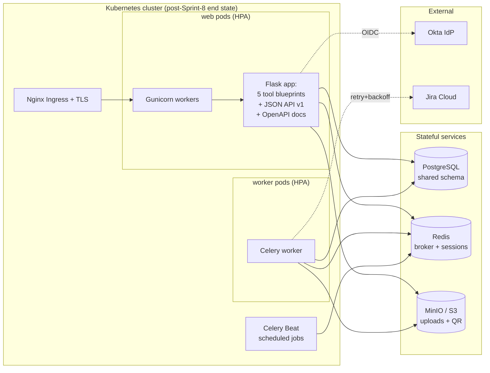

# Lab Tech Portal Architecture

> **DRAFT — finalized in Sprint 8 Wave 5 after all implementation slices ship.**

## Overview

The Lab Tech Portal is a production-grade, multi-container Flask application that orchestrates five specialized lab tools (Inventory, RF Chamber, Equipment Checkout, System Locator, 3D Print Requests) with Okta SSO, Jira integration, and asynchronous task processing. Post-Sprint-8, the architecture is a unified Kubernetes-ready deployment stack: a single Flask app with modular blueprints, async workers powered by Celery + Redis, PostgreSQL for shared state, MinIO/S3 for file storage, and comprehensive observability (Prometheus + structured logging).

**Current Sprint 8 state** (after Sprints 1–7): Celery workers, Redis broker, and Celery Beat periodic tasks are live. SQLite still powers the five tools' databases; PostgreSQL migration is planned for later sprints. The system is containerized via Docker Compose and can scale to Kubernetes.

---

## System Component Diagram



---

## HTTP Request Lifecycle

**End-state path** (post-Sprint-8): Browser → TLS Ingress → Gunicorn (4 workers) → Flask blueprint → SQLAlchemy ORM → PostgreSQL → Response

**Current path** (Sprint ≤7): Browser → host port-forward → Gunicorn → Flask blueprint → raw `sqlite3` → SQLite file under `/data/db/<tool>.db` → Response. TLS termination, SQLAlchemy ORM, and PostgreSQL all land in Sprint 8.

1. Client (browser or external API) makes an HTTP request with optional session cookie
2. (End-state) TLS Ingress (Nginx or traefik) terminates TLS, forwards to `web` pod on `:8000`; (current) host networking forwards to Docker Compose web service
3. Gunicorn receives request, routes to Flask app factory
4. Flask middleware:
   - Binds request UUID (correlation ID) to request context for structured logging
   - Resolves user from session (Redis-backed in Sprint 8 Wave 1; cookie-backed in Sprint ≤7)
   - Applies RBAC rules via `@requires_role("admin" | "lab-tech-lead" | "lab-tech" | "viewer")` — see `services/rbac.py` for the authoritative tier list
5. Blueprint handler (e.g., `tools/inventory/inventory_app.py`) processes request:
   - (End-state) queries database via SQLAlchemy session; (current) raw `sqlite3.connect()` via the tool's `db.py` module
   - May trigger async Celery tasks for long-running work (Jira API calls, file uploads)
   - Renders HTML template or returns JSON from `tools/api_v1/api_v1_app.py`
6. Response sent back through TLS Ingress (end-state) or host port-forward (current) to client

---

## Async Task Lifecycle (Celery + Redis)

**Path**: Web handler → `apply_async()` (enqueues task to Redis) → Celery worker pulls task → executes with retries → updates database → web polls `/api/v1/tasks/<id>/status`

1. User submits a form that triggers a long-running operation (e.g., "create Jira ticket")
2. Blueprint handler receives request and immediately returns "Processing..." HTML or `{"state": "pending"}`
3. Handler calls Celery task via `tasks.create_jira_ticket.apply_async(args=(...))`:
   - Task is serialized (JSON) and enqueued to Redis message broker
   - Task receives a unique UUID (e.g., `a1b2c3d4-e5f6-...`)
4. Celery worker (running in separate container):
   - Pulls task from Redis queue
   - Executes task code (with Flask app context)
   - On failure: retries with exponential backoff (up to 3 attempts)
   - Writes result (success or error) to database
   - Stores task status in Celery result backend (Redis)
5. Web UI polls `/api/v1/tasks/<id>/status` every 2–5 seconds:
   - Returns `{"state": "PENDING"}` → wait
   - Returns `{"state": "SUCCESS", "result": {"jira_key": "QENG-1234"}}` → refresh page
   - Returns `{"state": "FAILURE", "error": "Jira API timeout"}` → show error banner

**Use cases**:
- Print request submission: enqueue `tasks.create_jira_ticket()`, `tasks.upload_jira_attachment()`
- System Locator Jira import: enqueue `tasks.sync_jira_import()`
- Inventory QR code generation: enqueue `tasks.generate_qr_code()` (optional; can be sync)

---

## Authentication & Session Lifecycle (Okta OIDC)

**Path**: Browser → redirect to Okta → user logs in → callback → exchange code for token → session to Redis

1. Unauthenticated request hits protected endpoint (e.g., `GET /inventory/`)
2. Flask-Login redirect kicks in: `redirect(url_for('okta.login'))`
3. User is sent to Okta login page (tenant-specific URL)
4. User enters credentials (or SSO via employer directory)
5. Okta redirects back to callback endpoint with an authorization code
6. Flask `okta_auth.py` exchanges code for ID token + access token (OIDC flow)
7. Token is validated (signature, expiry, issuer)
8. User object created/updated in Flask-Login: `session['user_id']` = user email
9. Session serialized and stored in Redis (via `flask-session[redis]`):
   - Key: `session:<session_id>`
   - Value: `{"user_id": "user@alarm.com", "email": "...", "groups": [...]}`
   - TTL: 1 week (configurable)
10. Session cookie sent to browser (secure, httponly, sameSite=Lax)
11. On next request, Flask resolves user from Redis session by cookie ID
12. If session expired or invalid: redirect to Okta login again

**Logout**: User clicks "Logout" → session deleted from Redis → session cookie cleared → Okta redirect for full logout (optional)

---

## File Upload Lifecycle (MinIO / S3)

**Current Sprint ≤7**: Local filesystem; Sprint 8+ moves to MinIO/S3.

**Path**: Form POST → Flask handler → `ObjectStorage.put()` → presigned URL → read via `/api/v1/files/<id>`

1. User uploads a file (STL, 3MF, PNG) via print request form
2. Flask handler receives multipart form data
3. File validated (size, MIME type)
4. Call `ObjectStorage.put(key=f"uploads/print-request-{id}/design.stl", file=file_obj)`:
   - MinIO/S3 stores the file under that key
   - Database row updated with relative key (NOT full path)
5. Database row saved: `{"uploaded_file_path": "uploads/print-request-123/design.stl"}`
6. User later requests the file:
   - Click download link → `GET /api/v1/print-requests/123/download`
   - Handler calls `ObjectStorage.url_for(key)` → generates presigned URL (valid 15 min)
   - Presigned URL returned or redirected to client
   - Client browser downloads from MinIO/S3 directly (CDN-compatible)

**Benefit of presigned URLs**: Files are served by MinIO/S3, not through Flask (scale bottleneck avoided).

---

## Kubernetes Topology & Scaling

### Deployments (Stateless)

**web** (Flask + Gunicorn)
- Replicas: 2–10 (HPA scales based on CPU %)
- Resource requests: 512 Mi memory, 250m CPU
- Liveness probe: `/healthz` (responds 200 OK in < 5 sec)
- Readiness probe: `/readyz` (checks database, Redis, file storage connectivity)
- Rolling update strategy (surge=25%, unavailable=0%)

**worker** (Celery worker)
- Replicas: 2–8 (HPA scales by Redis queue length, optional)
- Concurrency: 4 tasks per pod (environment variable `CELERY_WORKER_CONCURRENCY`)
- Prefetch: 2 tasks per worker (prevents memory bloat)
- Heartbeat: 2 seconds (detects dead workers quickly)
- Restarts on crash (restart policy)

**beat** (Celery Beat)
- Replicas: 1 (single scheduler instance across the cluster)
- Scheduled tasks: `sync_jira_systems` (15 min), `check_stale_checkouts` (daily 9 AM), `backup_databases` (daily 2 AM)

### Services (Stateful)

**PostgreSQL** (Managed service or StatefulSet)
- Single primary + read replicas (HA optional)
- PersistentVolume: 50 GB (production), 10 GB (staging)
- Backup: Daily `pg_dump` via CronJob → object storage
- Connection pooling: PgBouncer (optional, for connection reuse)

**Redis** (Managed service or StatefulSet)
- Master + sentinel or cluster mode
- Persistent: RDB dump + AOF for durability
- Used for: Celery message broker, session store, rate-limit counters, lock state

**MinIO / S3**
- Object storage for file uploads, generated QR codes, backups
- Policy: Versioning on (for rollback), lifecycle rules (clean up tmp uploads after 30 days)

### Ingress & Networking

- **Ingress controller**: Nginx or Traefik
- **TLS**: cert-manager + Let's Encrypt (auto-renew)
- **DNS**: Route53 or Cloudflare
- **Network policy**: Restrict outbound egress (only to Jira, Okta, file storage)

### Secrets & ConfigMaps

**Secrets** (Kubernetes Secret):
- `OKTA_CLIENT_SECRET`
- `JIRA_PAT`
- `DATABASE_PASSWORD`
- `REDIS_PASSWORD`
- `S3_SECRET_KEY`
- `SECRET_KEY` (Flask)

**ConfigMaps**:
- `LOG_LEVEL`, `FLASK_ENV`, port, worker counts, etc.
- `.env` variables (non-sensitive)

### CronJobs & Maintenance

**Daily 2 AM UTC**: `pg_dump lab_tech_portal | gzip > s3://backups/daily-$(date +%s).gz`

**Weekly**: Clean up abandoned upload files older than 30 days

**Monthly**: Archive old logs to cold storage

---

## Data Persistence & Volumes

| Component | Storage | Lifecycle | Backup Strategy |
|-----------|---------|-----------|-----------------|
| **PostgreSQL data** | PersistentVolume (50 GB prod) | Persistent across restarts | Daily `pg_dump` + WAL archiving |
| **Redis data** | PersistentVolume (5 GB) | Persistent (RDB + AOF) | Included in daily pg_dump |
| **Uploaded files** | MinIO/S3 bucket | Persistent, versioned | S3 versioning + cross-region replication |
| **Generated QR codes** | MinIO/S3 bucket | Cached (can be regenerated) | Lifecycle rule: delete after 90 days |
| **Application logs** | stdout → log aggregator (ELK, Datadog, etc.) | Persisted to external store | Retention policy: 30 days hot, 90 days archive |

---

## Current Sprint 8 State vs. Post-Sprint-8 End State

### What's Already Shipped (Sprints 1–7)

| Feature | Shipped PR | Status |
|---------|-----------|--------|
| **Slice 0a**: Centralized config, deferred DB init | #45-#48 | ✓ Complete |
| **Slice 0b**: CI gate for test coverage | #50 | ✓ Complete |
| **Slice A**: Flask app factory, configuration classes | #49 | ✓ Complete |
| **Slice B**: Audit log middleware, RBAC enforcement, Prometheus metrics | #51–#52 | ✓ Complete |
| **Slice C**: Celery worker + Beat, async Jira tasks, task status tracking | #53–#70 | ✓ Complete |
| **Slice D-part1**: SQLAlchemy ORM spike on Equipment Checkout | #72 | ✓ Complete |
| **Slice G-part1**: Dockerfile (multi-stage), docker-compose.yml, Gunicorn, CI/CD | #58 | ✓ Complete |
| **Slice H**: OpenAPI documentation (Swagger/Flasgger) | #73 | ✓ Complete |
| **API v1**: JSON endpoints for all 5 tools, QR generation | #61–#91 | ✓ Complete |

### What's Still Planned (Sprint 8+ to end state)

| Feature | PR(s) | Planned Sprint | Notes |
|---------|-------|---|---|
| **Slice D-part2**: Full SQLAlchemy migration (all 5 tools) | TBD | Sprint 8 | Current: mixed SQLite + ORM |
| **Slice D-part3**: PostgreSQL production setup + migration script | TBD | Sprint 8 | Move all data from SQLite → PG |
| **Slice D-part4**: Alembic migrations framework | TBD | Sprint 8 | Replace ad-hoc `_migrate_schema()` |
| **Slice D-part5**: Redis session storage (externalize from cookies) | TBD | Sprint 8 | Enable multi-replica scaling |
| **Slice E**: MinIO / S3 integration (file uploads) | TBD | Sprint 8 | Replace local FS with object storage |
| **Slice F**: Load test framework + performance baseline | TBD | Sprint 8 | Validate multi-pod scaling |
| **Kubernetes manifests**: Helm chart or Kustomize | TBD | Wave 4–5 | Manifests, HPA, CronJobs, secrets |

---

## How to Add a New Tool

When a new tool (e.g., **"Equipment Loans"**) is proposed, follow this pattern. Reference implementation: `tools/system_locator/` (complete with models, migrations, UI, API, Jira integration).

### 1. Create Blueprint Directory & Files

```bash
mkdir -p tools/equipment_loans/{templates,static}
touch tools/equipment_loans/equipment_loans_app.py
touch tools/equipment_loans/models.py
touch tools/equipment_loans/db.py
touch tools/equipment_loans/tasks.py  # if async work needed
```

### 2. Define SQLAlchemy Models

In `tools/equipment_loans/models.py`:

```python
from datetime import datetime
from sqlalchemy import Column, String, DateTime, Integer, ForeignKey
from sqlalchemy.orm import relationship
from services.database import Base

class LoanRecord(Base):
    __tablename__ = "equipment_loans"
    
    id = Column(Integer, primary_key=True)
    equipment_id = Column(String, nullable=False)
    borrower_email = Column(String, nullable=False)
    checkout_date = Column(DateTime, default=datetime.utcnow, nullable=False)
    expected_return_date = Column(DateTime, nullable=False)
    actual_return_date = Column(DateTime, nullable=True)
    notes = Column(String, nullable=True)
```

### 3. Create Database Module

In `tools/equipment_loans/db.py`:

```python
from sqlalchemy.orm import sessionmaker
from services.database import get_engine
from . import models

Session = sessionmaker(bind=get_engine())

def create_loan(equipment_id: str, borrower_email: str, return_date: str) -> models.LoanRecord:
    session = Session()
    loan = models.LoanRecord(
        equipment_id=equipment_id,
        borrower_email=borrower_email,
        expected_return_date=return_date
    )
    session.add(loan)
    session.commit()
    session.refresh(loan)
    return loan

def get_active_loans() -> list:
    session = Session()
    return session.query(models.LoanRecord).filter(models.LoanRecord.actual_return_date == None).all()
```

### 4. Generate Alembic Migration

```bash
cd backend/  # where alembic.ini lives
alembic revision --autogenerate -m "add equipment_loans table"
# Review alembic/versions/XXXX_add_equipment_loans.py
alembic upgrade head  # Apply to local DB
```

### 5. Create Flask Blueprint

In `tools/equipment_loans/equipment_loans_app.py`:

```python
from flask import Blueprint, render_template, request, jsonify
from flask_login import login_required, current_user
from services.rbac import requires_role
from . import db, models

equipment_loans_bp = Blueprint("equipment_loans", __name__, url_prefix="/equipment-loans")

@equipment_loans_bp.route("/", methods=["GET"])
@login_required
@requires_role("viewer")  # any authenticated user (lowest tier)
def list_loans():
    loans = db.get_active_loans()
    return render_template("equipment_loans/list.html", loans=loans)

@equipment_loans_bp.route("/checkout", methods=["POST"])
@login_required
@requires_role("lab-tech")  # one of: admin, lab-tech-lead, lab-tech (write-capable tiers)
def create_loan():
    equipment_id = request.form.get("equipment_id")
    return_date = request.form.get("return_date")
    loan = db.create_loan(equipment_id, current_user.email, return_date)
    return jsonify({"id": loan.id, "status": "success"}), 201

def init_app(app):
    """Register blueprint with app."""
    app.register_blueprint(equipment_loans_bp)
```

### 6. Create HTML Templates

`tools/equipment_loans/templates/equipment_loans/list.html` — extends `base.html`, inherits site styling.

### 7. Create API v1 Routes

In `tools/api_v1/api_v1_app.py`, add routes like:

```python
@api_v1_bp.route("/equipment-loans", methods=["GET"])
@login_required
def list_loans_api():
    """List all active loans (JSON)."""
    loans = equipment_loans_db.get_active_loans()
    return jsonify([{"id": l.id, "equipment_id": l.equipment_id, ...} for l in loans])

@api_v1_bp.route("/equipment-loans", methods=["POST"])
@login_required
def create_loan_api():
    """Checkout equipment (JSON)."""
    data = request.get_json()
    loan = equipment_loans_db.create_loan(...)
    return jsonify({"id": loan.id, ...}), 201
```

### 8. Add Tests

Create `tests/test_equipment_loans.py`:

```python
import pytest
from tools.equipment_loans import db

def test_create_loan(client):
    response = client.post("/equipment-loans/checkout", data={
        "equipment_id": "SOLDERING-STATION-1",
        "return_date": "2026-05-20"
    })
    assert response.status_code == 201

def test_list_loans_api(client):
    response = client.get("/api/v1/equipment-loans")
    assert response.status_code == 200
    assert isinstance(response.json, list)
```

### 9. (Optional) Add Celery Tasks

If the tool needs async work (e.g., "remind user to return equipment"):

In `tools/equipment_loans/tasks.py`:

```python
from celery_app import celery

@celery.task(bind=True, max_retries=3)
def send_return_reminder(self, loan_id: int):
    try:
        loan = db.get_loan(loan_id)
        send_email(loan.borrower_email, f"Equipment return due in 3 days")
    except Exception as exc:
        self.retry(exc=exc, countdown=60)
```

### 10. Register Blueprint in app.py

```python
from tools.equipment_loans.equipment_loans_app import equipment_loans_bp, init_app as loans_init

app.register_blueprint(equipment_loans_bp)
loans_init(app)
```

### 11. Update 5-Tool Coverage Matrix

In the 5-tool coverage matrix (docs or issues), add `Equipment Loans` as tool #6:

```
| Tool | HTML | JSON API | Tests | Jira | Async |
|------|------|----------|-------|------|-------|
| ... |
| Equipment Loans | ✓ | ✓ | ✓ | ✓ | ✓ |
```

---

## Observability & Monitoring

### Structured Logging

Every log line includes:
- **Request ID**: UUID bound at Flask middleware entry; propagated to all log calls
- **User ID**: Email of authenticated user (or "anonymous")
- **Timestamp**: ISO 8601 UTC
- **Level**: INFO, WARNING, ERROR, CRITICAL
- **Message**: Human-readable description
- **Context**: Tool name, operation, status code, duration

**Example**:
```json
{
  "timestamp": "2026-05-15T14:23:45.123Z",
  "request_id": "a1b2c3d4-e5f6-4789-0abc-def012345678",
  "user_id": "snodder@alarm.com",
  "level": "INFO",
  "message": "inventory.add_item completed",
  "duration_ms": 245,
  "tool": "inventory"
}
```

### Prometheus Metrics

Exposed at `/metrics` (Prometheus format):

- **HTTP request latency** (histogram by endpoint, method, status)
- **Celery task duration & outcome** (by task name, success/failure)
- **Database query count & latency** (by operation type)
- **Redis queue depth** (tasks pending per queue)
- **Jira API call count & errors** (by operation, status)
- **Error rate** (5xx errors per minute)

### Alerts

Example Prometheus alert rules (in `prometheus.yml`):

```yaml
- alert: HighErrorRate
  expr: rate(http_requests_total{status=~"5.."}[5m]) > 0.05
  for: 5m
  annotations:
    summary: "High error rate detected"
```

---

## Security Model

### Authentication

- **Okta OIDC**: Primary auth, mandatory for any production deployment
- **Fallback (dev only)**: `LOGIN_DISABLED=true` in local `.env`
- **Session timeout**: 1 week, or immediately on logout

### Authorization (RBAC)

Users assigned to one of **four** tiers via the `@requires_role("role")` decorator. The authoritative tier list and tier-resolution logic live in `services/rbac.py`:

| Role | Permissions | Typical user |
|------|-----------|--------------|
| **admin** | Full control, user management, audit log | QE platform owners |
| **lab-tech-lead** | All `lab-tech` actions plus approvals and admin-adjacent functions per tool | Team leads |
| **lab-tech** | Create / update / delete in assigned tools | Day-to-day lab technicians |
| **viewer** | Read-only access to all tool UIs and APIs | Any other authenticated user (default fallback) |

Tier source: Okta groups resolved at login via `RBAC_ADMIN_GROUPS`, `RBAC_LAB_TECH_LEAD_GROUPS`, `RBAC_LAB_TECH_GROUPS` env vars. Any authenticated user not matching a configured group falls back to `viewer`.

### Secrets & Credentials

- **Environment variables** (never in source code): `OKTA_CLIENT_SECRET`, `JIRA_PAT`, database password
- **Kubernetes Secrets**: Mounted as files in pod (not env vars, to prevent leakage in `ps` output)
- **SealedSecrets** (GitOps): Encrypted in git, decrypted at cluster runtime
- **Audit log**: All user actions logged with timestamp, user, action, result

### Data Protection

- **TLS in transit**: Kubernetes Ingress + cert-manager
- **Encryption at rest**: Database (PG encryption + backups to encrypted S3)
- **CORS**: Restricted to same-origin (no * wildcard)
- **CSRF**: Flask-WTF CSRF tokens on all mutation endpoints
- **Rate limiting**: Flask-Limiter (10 req/min per IP for public endpoints)
- **Input validation**: SQLAlchemy models + schema validation (Marshmallow, optional)

---

## Development Workflow

### Local Development (Docker Compose)

```bash
# 1. Clone repo
git clone https://github.com/adc-quality/lab-tech-portal.git
cd lab-tech-portal

# 2. Create .env from template
cp .env.example .env
# Edit .env: OKTA_ISSUER, JIRA_URL, etc.

# 3. Start containers
docker compose up -d

# 4. Access app
# Web: http://localhost:8000
# Swagger: http://localhost:8000/api/v1/docs
# Prometheus: http://localhost:9090
# Grafana: http://localhost:3000 (docker compose up -d --profile grafana)

# 5. Run tests inside container
docker compose exec web python -m pytest tests/ -v

# 6. View logs
docker compose logs -f web

# 7. Stop
docker compose down
```

### Running Celery Worker Locally

```bash
# Terminal 1: Flask dev server
python -m flask --app app run --debug

# Terminal 2: Celery worker
celery -A celery_app worker --loglevel=debug

# Terminal 3: Celery Beat (for scheduled tasks)
celery -A celery_app beat --loglevel=debug
```

### Testing

```bash
# Unit tests
python -m pytest tests/ -v

# With coverage
python -m pytest tests/ --cov=tools --cov=services --cov-report=html

# Integration tests (requires running Celery & Redis)
python -m pytest tests/test_integration/ -v
```

---

## References

- **Docker Compose**: [docker-compose.yml](./docker-compose.yml) — full topology definition
- **Dockerfile**: [Dockerfile](./Dockerfile) — multi-stage build (web, worker, beat targets)
- **Configuration**: [config.py](./config.py) — environment-based config classes
- **Kubernetes manifests**: (TBD, Wave 4–5) — Helm chart or Kustomize overlays
- **Roadmap**: [docs/CONTAINERIZATION_ROADMAP.md](./docs/CONTAINERIZATION_ROADMAP.md) — full 8-sprint plan and deficiency tracking
- **Sprint plans**: [docs/sprint-plans/](./docs/sprint-plans/) — execution details for each sprint
